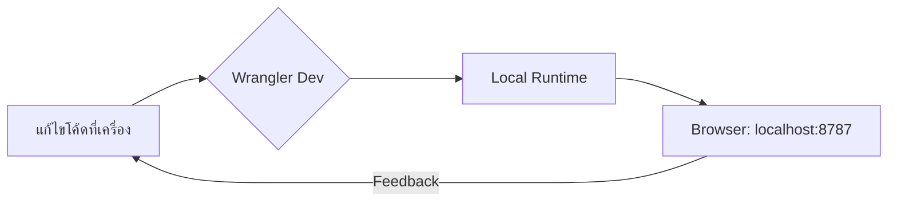

# คู่มือการใช้งาน Cloudflare Wrangler CLI (ฉบับสมบูรณ์ 2024-2026)

คู่มือนี้จะช่วยให้คุณเริ่มต้นใช้งาน **Wrangler** ซึ่งเป็น Command Line Interface (CLI) หลักสำหรับพัฒนาและ Deploy แอปพลิเคชันบน Cloudflare Developer Platform (Workers, Pages, R2, D1, และอื่นๆ)

---

## 1. การเตรียมความพร้อม (Prerequisites)

ก่อนเริ่มต้น คุณต้องมีสิ่งเหล่านี้ติดตั้งในเครื่อง:
*   **Node.js**: เวอร์ชัน 18.0.0 หรือสูงกว่า
*   **npm**: (ติดตั้งมาพร้อมกับ Node.js)
*   **บัญชี Cloudflare**: [สมัครใช้งานฟรีที่นี่](https://dash.cloudflare.com/sign-up)

---

## 2. การติดตั้ง (Installation)

ติดตั้ง Wrangler ทั่วทั้งระบบ (Global) เพื่อให้เรียกใช้งานได้จากทุกที่:

```bash
npm install wrangler@latest -g
```

ตรวจสอบเวอร์ชันหลังติดตั้ง:
```bash
wrangler --version
```

> **ภาพประกอบที่ 1**: หน้าจอ Terminal แสดงการพิมพ์คำสั่ง `wrangler --version` และผลลัพธ์เลขเวอร์ชัน (เช่น v4.x.x)

---

## 3. การเข้าสู่ระบบ (Authentication)

เพื่อให้ Wrangler สามารถจัดการทรัพยากรบนบัญชีของคุณได้ คุณต้อง Login ก่อน:

```bash
wrangler login
```

**ขั้นตอน:**
1. คำสั่งจะเปิดเบราว์เซอร์ขึ้นมาโดยอัตโนมัติ
2. เข้าสู่ระบบด้วยบัญชี Cloudflare ของคุณ
3. คลิกปุ่ม **"Allow"** เพื่ออนุญาตให้ Wrangler เข้าถึงข้อมูล

> **ภาพประกอบที่ 2**: หน้าต่าง Browser แสดงหน้าการยืนยันสิทธิ์ "Wrangler would like to access your Cloudflare account" พร้อมปุ่ม Allow สีฟ้า

---

## 4. เริ่มต้นโปรเจกต์ใหม่ (Project Initialization)

สร้างโปรเจกต์ Worker ใหม่ด้วยคำสั่งเดียว:

```bash
wrangler init my-first-worker
```

**สิ่งที่ต้องเลือก (Recommended):**
*   **Type**: เลือก "Hello World" worker
*   **Language**: เลือก TypeScript (แนะนำ) หรือ JavaScript
*   **Git**: ตอบ Yes เพื่อสร้าง Git repository

### โครงสร้างไฟล์ในโปรเจกต์
```text
my-first-worker/
├── node_modules/
├── src/
│   └── index.ts        # ไฟล์โค้ดหลัก
├── package.json
├── tsconfig.json
└── wrangler.toml       # ไฟล์ตั้งค่าหลัก (สำคัญมาก!)
```

---

## 5. การตั้งค่าผ่าน `wrangler.toml`

ไฟล์นี้ใช้สำหรับกำหนดชื่อโปรเจกต์, สภาพแวดล้อม (Environments), และการเชื่อมต่อกับฐานข้อมูล

```toml
name = "my-first-worker"
main = "src/index.ts"
compatibility_date = "2024-05-18"

# ตัวอย่างการเพิ่ม KV Namespace
# kv_namespaces = [
#   { binding = "MY_KV", id = "xxxxxxxxxxxxxxxxxxxxxxxx" }
# ]
```

---

## 6. การพัฒนาและทดสอบในเครื่อง (Local Development)

คุณสามารถรันแอปพลิเคชันของคุณในเครื่องเพื่อทดสอบก่อน Deploy จริง:

```bash
wrangler dev
```

*   **URL**: โดยปกติจะเป็น `http://localhost:8787`
*   **Hot Reload**: เมื่อคุณแก้ไขโค้ดใน `index.ts` ระบบจะอัปเดตให้อัตโนมัติทันที

> **ภาพประกอบที่ 3**: ไดอะแกรมแสดงขั้นตอนการทำงานของ Local Dev


---

## 7. การ Deploy ขึ้น Cloudflare

เมื่อพร้อมแล้ว ให้ส่งโค้ดของคุณขึ้นสู่ Edge Network ทั่วโลกของ Cloudflare:

```bash
wrangler deploy
```

หลังรันเสร็จ คุณจะได้ URL ของโปรเจกต์ (เช่น `my-first-worker.user.workers.dev`)

---

## 8. การจัดการความลับ (Secrets & Environment Variables)

สำหรับข้อมูลที่ Sensitive เช่น API Keys อย่าใส่ลงในโค้ดโดยตรง ให้ใช้ระบบ Secret:

```bash
wrangler secret put API_KEY
```
*ระบบจะให้คุณกรอกค่า Secret หลังจากกด Enter*

---

## 9. คำสั่งที่ใช้บ่อย (Common Commands Cheat Sheet)

| คำสั่ง | คำอธิบาย |
| :--- | :--- |
| `wrangler whoami` | ตรวจสอบว่ากำลัง Login ด้วยบัญชีใด |
| `wrangler tail` | ดู Log แบบ Real-time จาก Worker ที่ Deploy ไปแล้ว |
| `wrangler r2 bucket create <name>` | สร้าง Bucket สำหรับเก็บไฟล์ (R2 Storage) |
| `wrangler d1 create <name>` | สร้างฐานข้อมูล SQL (D1 Database) |
| `wrangler pages deploy <dir>` | Deploy เว็บไซต์แบบ Static ไปยัง Cloudflare Pages |

---

## 10. การทำงานร่วมกับทรัพยากรอื่นๆ (Advanced)

### การสร้าง R2 Bucket (Object Storage)
1. สร้าง Bucket: `wrangler r2 bucket create my-photos`
2. เพิ่มลงใน `wrangler.toml`:
```toml
[[r2_buckets]]
binding = 'MY_BUCKET'
bucket_name = 'my-photos'
```

### การ Deploy เว็บไซต์ด้วย Cloudflare Pages
หากคุณมีโปรเจกต์ที่เป็น Static Site (เช่น React, Vue, หรือ HTML ธรรมดา):
```bash
wrangler pages deploy <โฟลเดอร์ที่เก็บไฟล์>
```
เช่น: `wrangler pages deploy ./dist`

---

## 11. การดู Log (Live Logs)
หากต้องการ Debug โค้ดที่รันอยู่บน Production แบบ Real-time:
```bash
wrangler tail
```

---

**จัดทำโดย:** Pangkung - Microsoft 365 & Cloud Solutions Specialist
**ปรับปรุงล่าสุด:** พฤษภาคม 2026
